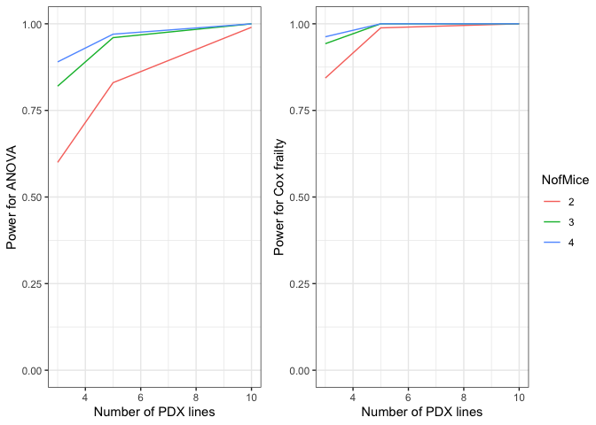

# PDXpower

<!-- badges: start -->
<!-- badges: end -->

The `PDXpower` package can conduct power analysis for time-to-event
outcome based on empirical simulations.

## Installation

You can install the development version of `PDXpower` from
[GitHub](https://github.com/) with:

``` r
# install.packages("devtools")
devtools::install_github("shanpengli/PDXpower")
```

## Example

Below is a toy example how to conduct power analysis based on a
preliminary dataset using the `PowFrailtyDat` function. Particularly, we
need to specify a formula that fits a Cox Frailty model with correlating
variables in `data`, where `Y` is the event time variable, `status` is
the event indicator, `Tx` is the treatment variable, and `ID` is the PDX
line variable.

``` r
library(PDXpower)
#> Loading required package: nlme
#> Loading required package: frailtypack
#> Loading required package: survival
#> Loading required package: boot
#> 
#> Attaching package: 'boot'
#> The following object is masked from 'package:survival':
#> 
#>     aml
#> Loading required package: MASS
#> Loading required package: survC1
#> Loading required package: doBy
#> 
#> Attaching package: 'frailtypack'
#> The following object is masked from 'package:survival':
#> 
#>     cluster
#> Loading required package: ggplot2
#> Loading required package: ggpubr
## simulate a dataset with a Weibull event outcome as a preliminary dataset
data <- SimPDXdata(seed = 1000, n = 3, m = 3, beta = -0.8, tau2 = 0.2, lambda = 0.03,
nu = 2, sigma2 = 1, distr = "Weibull", lambdaC = 0.1, censor = TRUE)

PowTab <- PowFrailtyDat(data = data, formula = Surv(Y,status) ~ Tx + cluster(ID),
n = c(3, 5, 10), m = c(2, 3, 4), sim = 100)
PowTab
#> 
#> Call:
#>  PowerTable(n = n, m = m, beta = beta, tau2 = tau2, lambda = lambda, nu = nu, two.sided = two.sided, distr = hazard, censor = censor, sim = sim, ncores = ncores) 
#> 
#>   PDX lines Mice ANOVA Cox Frailty
#> 1         3    2  0.60        0.84
#> 2         3    3  0.82        0.94
#> 3         3    4  0.89        0.96
#> 4         5    2  0.83        0.99
#> 5         5    3  0.96        1.00
#> 6         5    4  0.97        1.00
#> 7        10    2  0.99        1.00
#> 8        10    3  1.00        1.00
#> 9        10    4  1.00        1.00
plotpower(PowTab, ylim = c(0, 1))
```



Alternatively, we may also conduct power analysis based on median
survival of two randomized arms using the `PowFrailty` function. We
suppose that the median survival of the control and treatment arm is 2.4
and 4.8, allowing a PDX line has 10% marginal error (`tau2=0.1`) of
treatment effect and an exponential event time, a power analysis may be
done as below

``` r
library(PDXpower)
PowTab <- PowFrailty(ctl.med.surv = 2.4, tx.med.surv = 4.8, sim = 100, nu = 1, tau2 = 0.1,
n = c(3, 5, 10), m = c(2, 3, 4))
PowTab
#> 
#> Call:
#>  PowerTable(n = n, m = m, beta = beta, tau2 = tau2, lambda = lambda, nu = nu, two.sided = two.sided, distr = "Weibull", censor = censor, sim = sim, ncores = ncores) 
#> 
#>   PDX lines Mice ANOVA Cox Frailty
#> 1         3    2  0.19        0.28
#> 2         3    3  0.27        0.44
#> 3         3    4  0.28        0.45
#> 4         5    2  0.25        0.38
#> 5         5    3  0.34        0.54
#> 6         5    4  0.44        0.60
#> 7        10    2  0.35        0.65
#> 8        10    3  0.56        0.74
#> 9        10    4  0.75        0.91
plotpower(PowTab, ylim = c(0, 1))
```


