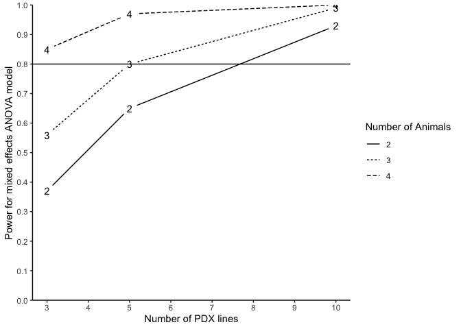

# PDXpower

<!-- badges: start -->
<!-- badges: end -->

The `PDXpower` package can conduct power analysis for time-to-event
outcome based on empirical simulations.

## Installation

You can install the development version of `PDXpower` from
[GitHub](https://github.com/) with:

``` r
# install.packages("devtools")
devtools::install_github("shanpengli/PDXpower")
```

## Example

Below is a toy example how to conduct power analysis based on a
preliminary dataset `mice`. Particularly, we need to specify a formula
that fits a Cox Frailty model with correlating variables in `mice`,
where `Y` is the event time variable, `status` is the event indicator,
`Tx` is the treatment variable, and `ID` is the PDX line ID.

``` r
library(PDXpower)
#> Loading required package: survival
#> Loading required package: parallel
data(mice)
### Power analysis on a preliminary dataset by assuming the time to event is Weibull-distributed
PowTab <- PowFrailtyDat(data = mice, formula = Surv(Y, status) ~ Tx + cluster(ID), 
                        n = c(3, 5, 10), m = c(2, 3, 4), sim = 100)
PowTab
#> Power analysis based on pilot data
#> 
#> A Cox frailty model was fitted
#> Summary of parameter estimates from the data:
#> Scale parameter (lambda): 0.0154 
#> Shape parameter (nu): 2.1722 
#> Treatment effect (beta): -0.8794 
#> Variance of random effect (tau2): 0.0422 
#> The above parameters are used for Monte Carlo data generation from a Cox frailty model.
#> Power for each combination of number of PDX lines (n) and number of mice per arm per PDX line (m) is calculated based on the proportion of rejecting the null hypothesis beta = 0.
#> 
#> Call:
#>  PowerTable(n = n, m = m, beta = beta, tau2 = tau2, lambda = lambda, nu = nu, two.sided = two.sided, distr = hazard, censor = censor, sim = sim, print = "Cox-frailty", ncores = ncores) 
#> 
#>    n m Power (%) Censoring Rate
#> 1  3 2     46.67              0
#> 2  3 3     55.43              0
#> 3  3 4     61.96              0
#> 4  5 2     61.90              0
#> 5  5 3     75.27              0
#> 6  5 4     82.98              0
#> 7 10 2     83.02              0
#> 8 10 3     94.79              0
#> 9 10 4     97.98              0
```

The following code generates a power curve based on the object `PowTab`.

``` r
plotpower(PowTab[[5]])
#> Warning: Removed 9 rows containing missing values (`geom_line()`).
```


Alternatively, we may also conduct power analysis based on ANOVA mixed
effects model.

``` r
### Power analysis on a preliminary dataset by assuming the time to event is log-normal
PowTab <- PowANOVADat(data = mice2, formula = log(Y) ~ Tx, 
                      random = ~ 1|ID, n = c(3, 5, 10), m = c(2, 3, 4), sim = 100)
PowTab
#> Power analysis based on pilot data
#> 
#> An ANOVA mixed effects model was fitted
#> Summary of parameter estimates from the data:
#> Treatment effect (beta): 0.1265 
#> Variance of random effect (tau2): 0 
#> Random error variance (sigma2): 0.4594 
#> The above parameters are used for Monte Carlo data generation from a ANOVA mixed effects model.
#> Power for each combination of number of PDX lines (n) and number of mice per arm per PDX line (m) is calculated based on the proportion of rejecting the null hypothesis beta = 0.
#> 
#> Call:
#>  PowerTable(n = n, m = m, beta = beta, tau2 = tau2, sigma2 = sigma2, two.sided = two.sided, distr = "normal", censor = FALSE, sim = sim, print = "ANOVA", ncores = ncores) 
#> 
#>    n m Power (%)
#> 1  3 2         7
#> 2  3 3         4
#> 3  3 4         7
#> 4  5 2         5
#> 5  5 3         5
#> 6  5 4         9
#> 7 10 2         6
#> 8 10 3         7
#> 9 10 4        11
plotpower(PowTab[[4]])
#> Warning: Removed 1 row containing missing values (`geom_line()`).
```



Alternatively, we may also conduct power analysis based on median
survival of two randomized arms. We suppose that the median survival of
the control and treatment arm is 2.4 and 4.8, allowing a PDX line has
10% marginal error (`tau2=0.1`) of treatment effect and an exponential
event time, a power analysis may be done as below:

``` r
### Assume the time to event outcome is weibull-distributed
PowTab <- PowFrailty(ctl.med.surv = 2.4, tx.med.surv = 4.8, nu = 1, tau2 = 0.1, sim = 100,
                     n = c(3, 5, 10), m = c(2, 3, 4))
PowTab
#> 
#> Call:
#>  PowerTable(n = n, m = m, beta = beta, tau2 = tau2, lambda = lambda, nu = nu, two.sided = two.sided, distr = "Weibull", censor = censor, sim = sim, print = "Cox-frailty", ncores = ncores) 
#> 
#>    n m Power (%) Censoring Rate
#> 1  3 2     27.55              0
#> 2  3 3     43.88              0
#> 3  3 4     44.79              0
#> 4  5 2     37.89              0
#> 5  5 3     53.54              0
#> 6  5 4     60.20              0
#> 7 10 2     64.95              0
#> 8 10 3     73.74              0
#> 9 10 4     91.00              0
```

``` r
### Assume the time to event outcome is log-normal
PowTab <- PowANOVA(ctl.med.surv = 2.4, tx.med.surv = 4.8, tau2 = 0.1, sigma2 = 1, sim = 100,
                   n = c(3, 5, 10), m = c(2, 3, 4))
PowTab
#> 
#> Call:
#>  PowerTable(n = n, m = m, beta = beta, tau2 = tau2, sigma2 = sigma2, two.sided = two.sided, distr = "normal", censor = FALSE, sim = sim, print = "ANOVA", ncores = ncores) 
#> 
#>    n m Power (%)
#> 1  3 2        21
#> 2  3 3        34
#> 3  3 4        40
#> 4  5 2        39
#> 5  5 3        55
#> 6  5 4        64
#> 7 10 2        64
#> 8 10 3        89
#> 9 10 4        89
```
