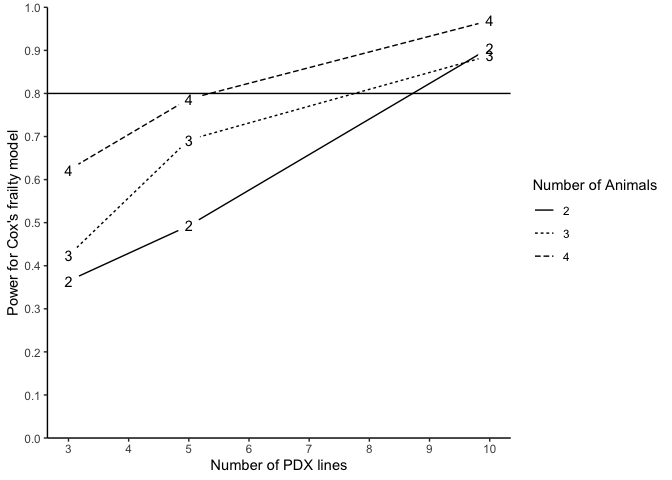

# PDXpower

<!-- badges: start -->

[](https://cran.r-project.org/package=PDXpower)
[](https://cran.r-project.org/package=PDXpower)
[](https://cran.r-project.org/package=PDXpower)
[](https://cran.r-project.org/package=PDXpower)
<!-- badges: end -->

The `PDXpower` package can conduct power analysis for time-to-event
outcome based on empirical simulations.

## Installation

You can install the development version of `PDXpower` from
[GitHub](https://github.com/) with:

``` r
# install.packages("devtools")
devtools::install_github("shanpengli/PDXpower")
```

## Example

Below is a toy example how to conduct power analysis based on a
preliminary dataset `animals1`. Particularly, we need to specify a
formula that fits a ANOVA mixed effects model with correlating variables
in `animals1`, where `ID` is the PDX line number, `Y` is the event time
variable, and `Tx` is the treatment variable.

Next, run power analysis by fitting a ANOVA mixed effects model on
`animals1`.

``` r
library(PDXpower)
data(animals1)
### Power analysis on a preliminary dataset by assuming the time to event is log-normal
PowTab <- PowANOVADat(data = animals1, formula = log(Y) ~ Tx, 
                      random = ~ 1|ID, n = c(3, 5, 10), m = c(2, 3, 4), sim = 100)
#> Parameter estimates based on the pilot data:
#> Treatment effect (beta): 0.7299 
#> Variance of random effect (tau2): 0.0332 
#> Random error variance (sigma2): 0.386 
#> 
#> Monte Carlo power estimate, calculated as the
#>   proportion of instances where the null hypothesis
#>   H_0: beta = 0 is rejected (n = number of PDX lines,
#>   m = number of animals per arm per PDX line,
#>   N = total number of animals for a given combination of n and m):
#>    n m  N Power (%)
#> 1  3 2 12        43
#> 2  3 3 18        65
#> 3  3 4 24        77
#> 4  5 2 20        70
#> 5  5 3 30        87
#> 6  5 4 40        95
#> 7 10 2 40        98
#> 8 10 3 60        99
#> 9 10 4 80       100
```

The following code generates a power curve based on the object `PowTab`.

``` r
plotpower(PowTab[[4]], ylim = c(0, 1))
```


Alternatively, we may also conduct power analysis based on median
survival of two randomized arms without the preliminary data. We suppose
that the median survival of the control and treatment arm is 2.4 and
7.2, assuming the intra-class correlation of 10%, a power analysis may
be done as below:

``` r
### Assume the time to event outcome is log-normal distributed
PowTab <- PowANOVA(ctl.med.surv = 2.4,
                   tx.med.surv = 7.2, icc = 0.1, sigma2 = 1, sim = 100, 
                   n = c(3, 5, 10), m = c(2, 3, 4))
#> Treatment effect (beta): -1.098612 
#> Variance of random effect (tau2): 0.1111111 
#> Intra-PDX correlation coefficient (icc): 0.1 
#> Random error variance (sigma2): 1 
#> 
#> Monte Carlo power estimate, calculated as the
#>   proportion of instances where the null hypothesis
#>   H_0: beta = 0 is rejected (n = number of PDX lines,
#>   m = number of animals per arm per PDX line,
#>   N = total number of animals for a given combination
#>   of n and m):
#>    n m  N Power (%)
#> 1  3 2 12        37
#> 2  3 3 18        56
#> 3  3 4 24        85
#> 4  5 2 20        65
#> 5  5 3 30        80
#> 6  5 4 40        97
#> 7 10 2 40        93
#> 8 10 3 60        99
#> 9 10 4 80       100
plotpower(PowTab, ylim = c(0, 1))
```


Alternatively, one can run power analysis by fitting a Cox frailty
model. Here we present another dataset `animals2`. Particularly, we need
to specify a formula that fits a Cox frailty model with correlating
variables in `animals2`, where `ID` is the PDX line number, `Y` is the
event time variable, `Tx` is the treatment variable, and `status` is the
event status.

``` r
data(animals2)
### Power analysis on a preliminary dataset by assuming the time to event is Weibull-distributed
PowTab <- PowFrailtyDat(data = animals2, formula = Surv(Y, status) ~ Tx + cluster(ID), 
                        n = c(3, 5, 10), m = c(2, 3, 4), sim = 100)
#> Parameter estimates based on the pilot data:
#> Scale parameter (lambda): 0.0154 
#> Shape parameter (nu): 2.1722 
#> Treatment effect (beta): -0.8794 
#> Variance of random effect (tau2): 0.0422 
#> 
#> Monte Carlo power estimate, calculated as the
#>   proportion of instances where the null hypothesis
#>   H_0: beta = 0 is rejected (n = number of PDX lines,
#>   m = number of animals per arm per PDX line,
#>   N = total number of animals for a given combination
#>   of n and m,
#>   Censoring Rate = average censoring rate across 500
#>   Monte Carlo samples):
#>    n m  N Power (%) for Cox's frailty Censoring Rate
#> 1  3 2 12                       36.49             NA
#> 2  3 3 18                       42.35             NA
#> 3  3 4 24                       62.22             NA
#> 4  5 2 20                       49.30             NA
#> 5  5 3 30                       69.23             NA
#> 6  5 4 40                       78.72             NA
#> 7 10 2 40                       90.57             NA
#> 8 10 3 60                       88.78             NA
#> 9 10 4 80                       96.91             NA
plotpower(PowTab[[5]], ylim = c(0, 1))
```



Alternatively, we may also conduct power analysis based on median
survival of two randomized arms. We suppose that the median survival of
the control and treatment arm is 2.4 and 4.8, allowing a PDX line has
10% marginal error (`tau2=0.1`) of treatment effect and an exponential
event time, a power analysis may be done as below:

``` r
### Assume the time to event outcome is weibull-distributed
PowTab <- PowFrailty(ctl.med.surv = 2.4, tx.med.surv = 4.8, nu = 1, tau2 = 0.1, sim = 100,
                     n = c(3, 5, 10), m = c(2, 3, 4))
#> Treatment effect (beta): -0.6931472 
#> Scale parameter (lambda): 0.2888113 
#> Shape parameter (nu): 1 
#> Variance of random effect (tau2): 0.1 
#> 
#> Monte Carlo power estimate, calculated as the
#>   proportion of instances where the null hypothesis
#>   H_0: beta = 0 is rejected (n = number of PDX lines,
#>   m = number of animals per arm per PDX line,
#>   N = total number of animals for a given combination
#>   of n and m,
#>   Censoring Rate = average censoring rate across 500
#>   Monte Carlo samples):
#>    n m  N Power (%) for Cox's frailty Censoring Rate
#> 1  3 2 12                       22.45             NA
#> 2  3 3 18                       21.05             NA
#> 3  3 4 24                       41.41             NA
#> 4  5 2 20                       35.16             NA
#> 5  5 3 30                       44.79             NA
#> 6  5 4 40                       62.89             NA
#> 7 10 2 40                       67.01             NA
#> 8 10 3 60                       73.74             NA
#> 9 10 4 80                       86.73             NA
plotpower(PowTab, ylim = c(0, 1))
```


