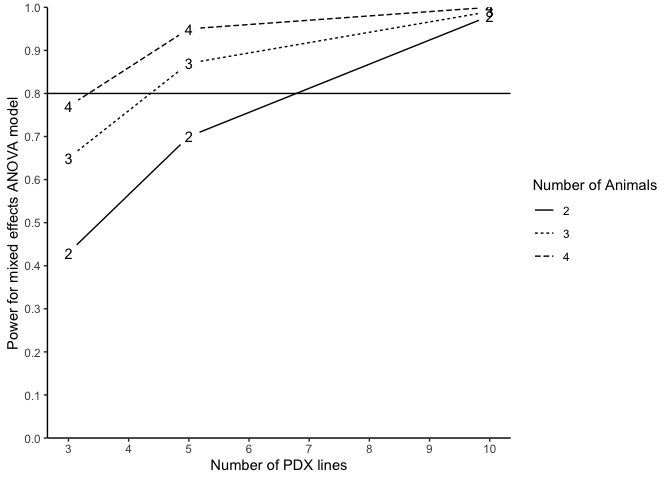

# PDXpower

<!-- badges: start -->

[](https://cran.r-project.org/package=PDXpower)
[](https://cran.r-project.org/package=PDXpower)
[](https://cran.r-project.org/package=PDXpower)
[](https://cran.r-project.org/package=PDXpower)
<!-- badges: end -->

The `PDXpower` package can conduct power analysis for time-to-event
outcome based on empirical simulations.

## Installation

You can install the development version of `PDXpower` from
[GitHub](https://github.com/) with:

``` r
# install.packages("devtools")
devtools::install_github("shanpengli/PDXpower")
```

## Example

Below is a toy example how to conduct power analysis based on a
preliminary dataset `mice1`. Particularly, we need to specify a formula
that fits a ANOVA mixed effects model with correlating variables in
`mice1`, where `ID` is the PDX line number, `Y` is the event time
variable, and `Tx` is the treatment variable.

Next, run power analysis by fitting a ANOVA mixed effects model on
`mice1`.

``` r
library(PDXpower)
#> Loading required package: survival
#> Loading required package: parallel
data(mice1)
### Power analysis on a preliminary dataset by assuming the time to event is log-normal
PowTab <- PowANOVADat(data = mice1, formula = log(Y) ~ Tx, 
                      random = ~ 1|ID, n = c(3, 5, 10), m = c(2, 3, 4), sim = 100)
PowTab
#> Power analysis based on pilot data
#> 
#> An ANOVA mixed effects model was fitted
#> Summary of parameter estimates from the pilot data:
#> Treatment effect (beta): -0.5569 
#> Variance of random effect (tau2): 0 
#> Random error variance (sigma2): 0.2554 
#> The above parameter estimates are used as priori for Monte Carlo data generation from a ANOVA mixed effects model to estimate the power.
#> The estimated power for each combination of number of PDX lines (n) and number of mice per arm per PDX line (m) is calculated as the proportion of rejecting the null hypothesis beta = 0.
#> The summary of power across all possible combinations of n and m is shown below.
#> 
#>    n m Power (%)
#> 1  3 2        37
#> 2  3 3        56
#> 3  3 4        85
#> 4  5 2        67
#> 5  5 3        81
#> 6  5 4        97
#> 7 10 2        93
#> 8 10 3        99
#> 9 10 4       100
```

The following code generates a power curve based on the object `PowTab`.

``` r
plotpower(PowTab[[4]], ylim = c(0, 1))
```



Or we can fit a ANOVA fixed effect model for running power analysis.

``` r
PowTabfit <- PowANOVADat(data = mice1, formula = log(Y) ~ Tx, 
                      random = ~ 1|ID, n = c(3, 5, 10), m = c(2, 3, 4), fixed.effect = TRUE, sim = 100)
PowTabfit
#> Power analysis based on pilot data
#> 
#> An ANOVA mixed effects model was fitted
#> Summary of parameter estimates from the pilot data:
#> Treatment effect (beta): -0.5569 
#> Variance of random effect (tau2): 0 
#> Random error variance (sigma2): 0.2554 
#> The above parameter estimates are used as priori for Monte Carlo data generation from a ANOVA mixed effects model to estimate the power.
#> The estimated power for each combination of number of PDX lines (n) and number of mice per arm per PDX line (m) is calculated as the proportion of rejecting the null hypothesis beta = 0.
#> The summary of power across all possible combinations of n and m is shown below.
#> 
#>    n m Power (%) for mixed effects Power (%) for fixed effects
#> 1  3 2                          NA                          16
#> 2  3 3                          NA                          20
#> 3  3 4                          NA                          27
#> 4  5 2                          NA                          23
#> 5  5 3                          NA                          31
#> 6  5 4                          NA                          42
#> 7 10 2                          NA                          46
#> 8 10 3                          NA                          54
#> 9 10 4                          NA                          68
```

Alternatively, one can run power analysis by fitting a Cox frailty
model. Here we present another dataset `mice2`. Particularly, we need to
specify a formula that fits a Cox frailty model with correlating
variables in `mice2`, where `ID` is the PDX line number, `Y` is the
event time variable, `Tx` is the treatment variable, and `status` is the
event status.

``` r
data(mice2)
### Power analysis on a preliminary dataset by assuming the time to event is Weibull-distributed
PowTab <- PowFrailtyDat(data = mice2, formula = Surv(Y, status) ~ Tx + cluster(ID), 
                        n = c(3, 5, 10), m = c(2, 3, 4), sim = 100)
PowTab
#> Power analysis based on pilot data
#> 
#> A Cox frailty model was fitted
#> Summary of parameter estimates from the pilot data:
#> Scale parameter (lambda): 0.0154 
#> Shape parameter (nu): 2.1722 
#> Treatment effect (beta): -0.8794 
#> Variance of random effect (tau2): 0.0422 
#> The above parameter estimates are used as priori for Monte Carlo data generation from a Cox frailty model to estimate the power.
#> The estimated power for each combination of number of PDX lines (n) and number of mice per arm per PDX line (m) is calculated as the proportion of rejecting the null hypothesis beta = 0.
#> The summary of power across all possible combinations of n and m is shown below.
#> 
#>    n m Power (%) for Cox frailty Censoring Rate
#> 1  3 2                     36.49              0
#> 2  3 3                     42.35              0
#> 3  3 4                     62.22              0
#> 4  5 2                     49.30              0
#> 5  5 3                     69.23              0
#> 6  5 4                     78.72              0
#> 7 10 2                     90.57              0
#> 8 10 3                     88.78              0
#> 9 10 4                     96.91              0
```

The following code generates a power curve based on the object `PowTab`.

``` r
plotpower(PowTab[[5]], ylim = c(0, 1))
```


Or we can fit a Cox fixed effect model for running power analysis.

``` r
PowTabfit <- PowFrailtyDat(data = mice2, formula = Surv(Y, status) ~ Tx + cluster(ID), 
                           n = c(3, 5, 10), m = c(2, 3, 4), fixed.effect = TRUE, sim = 100)
PowTabfit
#> Power analysis based on pilot data
#> 
#> A Cox frailty model was fitted
#> Summary of parameter estimates from the pilot data:
#> Scale parameter (lambda): 0.0154 
#> Shape parameter (nu): 2.1722 
#> Treatment effect (beta): -0.8794 
#> Variance of random effect (tau2): 0.0422 
#> The above parameter estimates are used as priori for Monte Carlo data generation from a Cox frailty model to estimate the power.
#> The estimated power for each combination of number of PDX lines (n) and number of mice per arm per PDX line (m) is calculated as the proportion of rejecting the null hypothesis beta = 0.
#> The summary of power across all possible combinations of n and m is shown below.
#> 
#>    n m Power (%) for Cox fixed effects Censoring Rate
#> 1  3 2                              36              0
#> 2  3 3                              48              0
#> 3  3 4                              65              0
#> 4  5 2                              57              0
#> 5  5 3                              71              0
#> 6  5 4                              83              0
#> 7 10 2                              90              0
#> 8 10 3                              92              0
#> 9 10 4                              97              0
```

Alternatively, we may also conduct power analysis based on median
survival of two randomized arms. We suppose that the median survival of
the control and treatment arm is 2.4 and 4.8, allowing a PDX line has
10% marginal error (`tau2=0.1`) of treatment effect and an exponential
event time, a power analysis may be done as below:

``` r
### Assume the time to event outcome is weibull-distributed
PowTab <- PowFrailty(ctl.med.surv = 2.4, tx.med.surv = 4.8, nu = 1, tau2 = 0.1, sim = 100,
                     n = c(3, 5, 10), m = c(2, 3, 4))
PowTab
#>    n m Power (%) for Cox frailty Censoring Rate
#> 1  3 2                     22.45              0
#> 2  3 3                     21.05              0
#> 3  3 4                     41.41              0
#> 4  5 2                     35.16              0
#> 5  5 3                     44.79              0
#> 6  5 4                     62.89              0
#> 7 10 2                     67.01              0
#> 8 10 3                     73.74              0
#> 9 10 4                     86.73              0
```

``` r
### Assume the time to event outcome is log-normal
PowTab <- PowANOVA(ctl.med.surv = 2.4, tx.med.surv = 4.8, tau2 = 0.1, sigma2 = 1, sim = 100,
                   n = c(3, 5, 10), m = c(2, 3, 4))
PowTab
#>    n m Power (%)
#> 1  3 2        24
#> 2  3 3        30
#> 3  3 4        36
#> 4  5 2        32
#> 5  5 3        47
#> 6  5 4        60
#> 7 10 2        60
#> 8 10 3        73
#> 9 10 4        87
```
